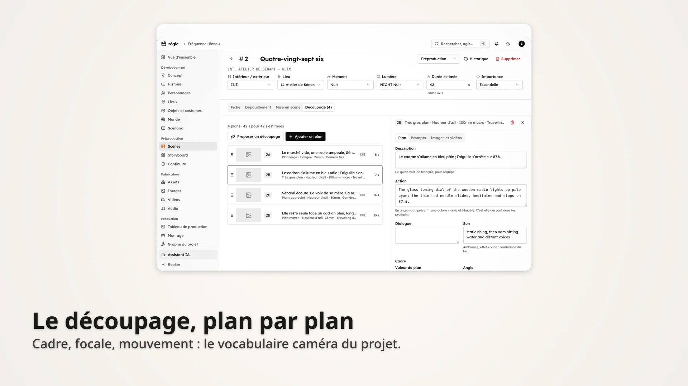
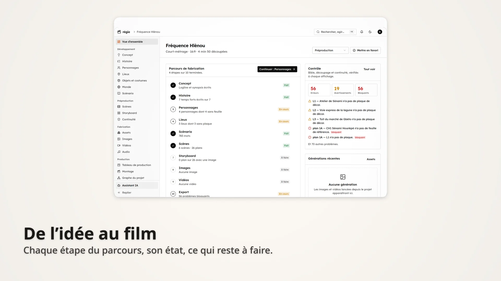
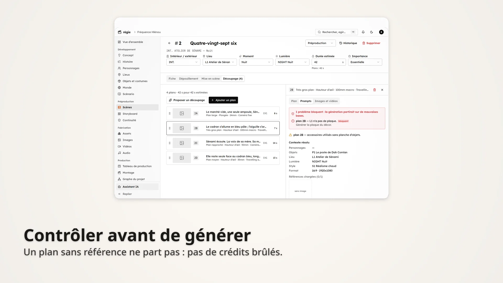
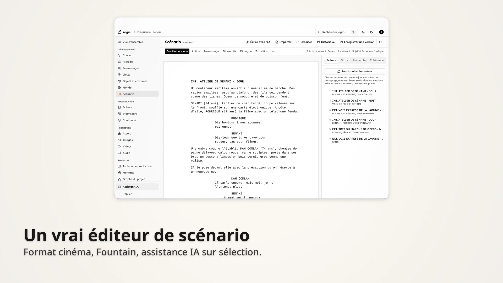
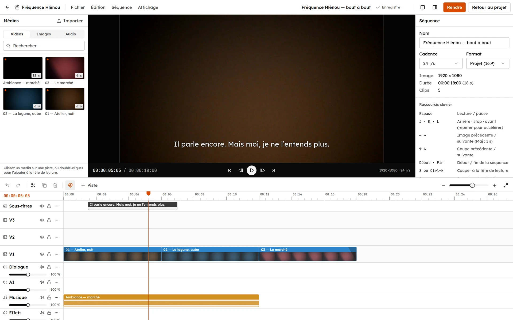
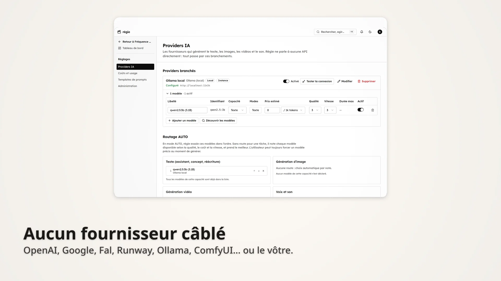

<div align="center">

# régie

**Une bible, un découpage, N moteurs.**

Le studio open source pour faire un film avec l'IA — de l'idée au montage —
sans que vos personnages changent de visage d'un plan à l'autre.

[Site et documentation](https://regie-studio.vercel.app) · [Démarrer](#démarrer-en-local) · [Contribuer](CONTRIBUTING.md) · [Licence MIT](LICENSE)



</div>

## Pourquoi

Un modèle d'IA n'a aucune mémoire entre deux générations. Tout ce qui n'est
ni écrit ni montré en image est réinventé, différemment à chaque fois : le
personnage change de visage, le décor de couleur, le costume de coupe.

régie part de ce constat. Vous décrivez votre film une seule fois — sa
**bible** : personnages, lieux, objets, style, lumières, règles — et chaque
prompt en est **compilé**, jamais réécrit à la main. Les images de référence
de chaque personnage et de chaque lieu sont chargées automatiquement dans
chaque plan où ils apparaissent. Un contrôle de continuité bloque les plans
qui partiraient sur de mauvaises bases, avant qu'ils ne coûtent des crédits.

Le projet est né du besoin d'un réalisateur qui voulait le processus complet,
de l'écriture à l'export, dans un seul outil. Il est publié pour celles et ceux
qui sont dans le même cas.

## Ce que fait régie



| Étape | Dans régie |
|---|---|
| **Concept** | de l'idée à la logline, au synopsis, au pitch ; listes de suggestions, éditeur riche, proposition de l'IA à appliquer champ par champ |
| **Histoire** | 7 structures (trois actes, voyage du héros, Save the Cat, Story Circle, Kishōtenketsu…), temps forts reliés aux scènes |
| **Bible** | personnages (description gelée, costume, silhouette, interdits, profil narratif), lieux, objets et costumes, monde, styles de rendu, lumières |
| **Scénario** | éditeur au format cinéma (Fountain), assistance IA sur sélection, versions, export PDF, Word, Final Draft, Fountain |
| **Découpage** | scènes, dépouillement, mise en scène, plans avec la bibliothèque caméra (cadres, angles, focales, mouvements) |
| **Prompts** | compilés depuis la bible pour chaque moteur — image fixe, Veo, Kling, Wan/ComfyUI, Runway, planche storyboard — visibles et réécrivables |
| **Génération** | image, vidéo, audio ; file d'attente, progression en temps réel, coût, relance, changement de modèle |
| **Cohérence** | références chargées dans chaque plan, contrôle de continuité, analyse IA |
| **Montage** | espace plein écran : séquences, pistes, sous-titres, assemblage depuis le découpage, rendu MP4/MOV réel, export SRT et EDL |
| **Production** | storyboard, tableau de production, assets, graphe du projet, assistant IA qui connaît tout le projet, suivi des coûts |

<table>
<tr>
<td></td>
<td></td>
</tr>
<tr>
<td></td>
<td></td>
</tr>
</table>

## Principes

- **Aucune génération simulée.** Sans fournisseur configuré, l'interface le
  dit et propose de le configurer. Rien ne fait semblant.
- **Aucun fournisseur câblé.** OpenAI, Anthropic, Google, Fal, Replicate,
  Runway, Luma, ElevenLabs, Ollama, ComfyUI, tout service compatible OpenAI
  (DeepInfra, Together, OpenRouter, Groq…) ou votre propre API : chacun est un
  adapter derrière une interface commune.
- **Contrôler avant de brûler des crédits.** Un plan sans référence ne part pas.
- **Vos données chez vous.** Auto-hébergé, clés des fournisseurs chiffrées en
  base, stockage privé.

## Démarrer en local

Prérequis : Node 20.11+, pnpm 10, Docker, FFmpeg (pour le rendu du montage).

```sh
git clone https://github.com/edwinfranck/regie.git && cd regie
cp .env.example .env
sed -i "s|^AUTH_SECRET=.*|AUTH_SECRET=$(openssl rand -base64 32)|" .env
sed -i "s|^ENCRYPTION_KEY=.*|ENCRYPTION_KEY=$(openssl rand -base64 32)|" .env

pnpm install
pnpm services        # Postgres, Redis, MinIO (docker compose)
pnpm db:deploy       # migrations
pnpm db:seed         # templates de prompts
pnpm dev             # http://localhost:3000 + worker de génération
```

Créez votre compte (le premier compte de l'instance est administrateur), puis
**Réglages → Providers IA** pour brancher au moins un modèle de texte et un
modèle d'image. Sans clé, un modèle local via [Ollama](https://ollama.com)
fait l'affaire pour le texte.

Pour découvrir l'outil sur un court-métrage déjà écrit — concept, bible,
scénario, scènes et découpage, sans aucune image générée :

```sh
pnpm db:seed:demo -- --email vous@exemple.com
```

Tout en conteneurs, application comprise : `docker compose --profile app up --build`.

## Structure

```
apps/
  web/        Next.js — interface et API (route handlers, temps réel SSE)
  worker/     worker BullMQ — générations et rendus de montage (FFmpeg)
  site/       landing et documentation (Fumadocs)
packages/
  core/       le domaine pur : caméra, Context Builder, compilateur, linter, Fountain, montage
  providers/  adapters des fournisseurs d'IA, routeur, coûts, chiffrement des clés
  studio/     services serveur : bible, pipeline de génération, tâches IA, droits, import
  db/         schéma Prisma, migrations, seed et projet de démonstration
  jobs/       files BullMQ et événements temps réel
  storage/    stockage S3 (AWS, Cloudflare R2, Supabase, MinIO)
```

| Commande | |
|---|---|
| `pnpm dev` | web + worker |
| `pnpm dev:site` | site et documentation sur :3100 |
| `pnpm typecheck` · `pnpm test` | types et tests unitaires |
| `pnpm test:integration` | pipeline complet contre les services locaux |
| `pnpm test:e2e` | parcours navigateur (Playwright) |

## Documentation

La documentation complète est sur **[le site](https://regie-studio.vercel.app/docs)** : guide
d'utilisation étape par étape, fournisseurs, architecture, déploiement. Les
notes techniques sont aussi dans [`docs/`](docs).

## Contribuer

Toute contribution est bienvenue : code, documentation, traductions, retours
d'usage. Lisez [CONTRIBUTING.md](CONTRIBUTING.md) — en particulier les
principes, qui ne sont pas négociables.

## Licence

[MIT](LICENSE). Utilisez, modifiez, redistribuez.
